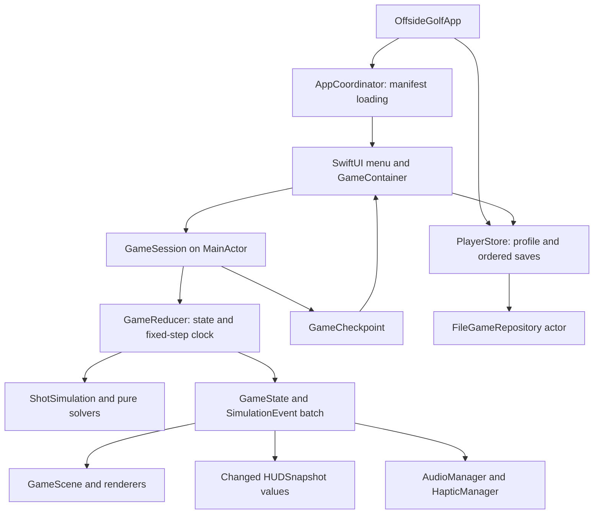
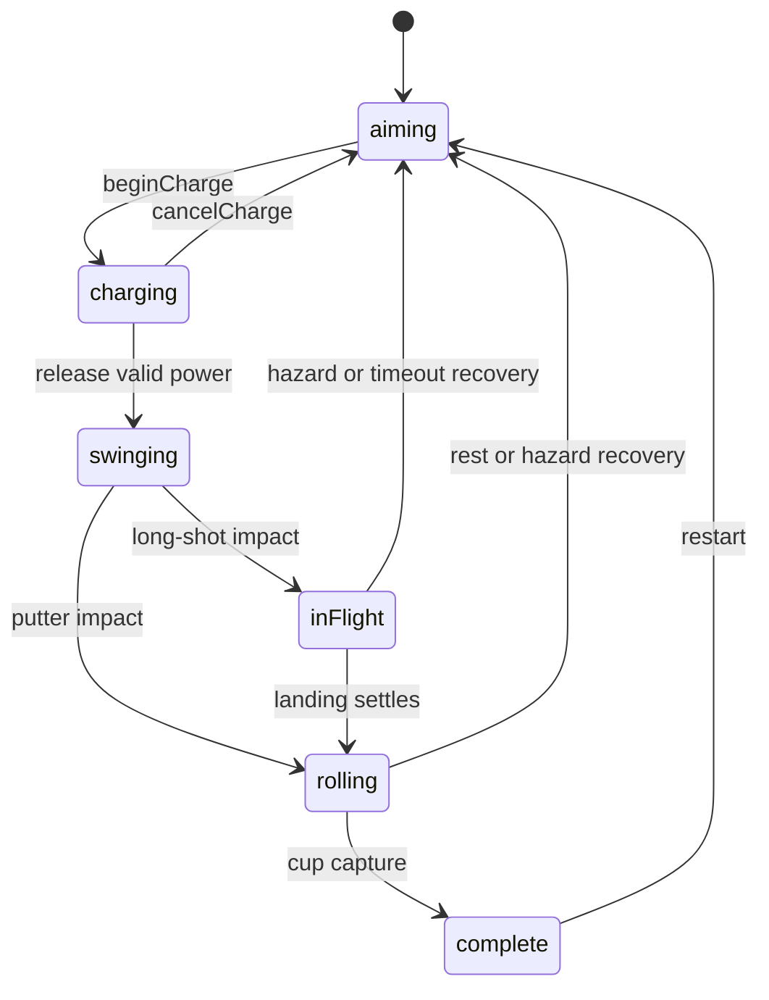

# OffsideGolf — technical architecture

This describes the source implementation as of 2026-09-17. Product intent remains in `DECISIONS.md` and `PRD.md`; implementation is not physical-device or release approval. See `VERIFICATION.md` for the current evidence and open gates.

## Boundaries and ownership

`Packages/OffsideGolfCore` is a Foundation-only Swift 6 package. It owns content validation, geometry, clubs, deterministic simulation, scoring and Codable save values. It imports no SwiftUI, SpriteKit or UIKit. The iOS target owns presentation, storage I/O, audio and haptics.

`AppCoordinator` loads the course manifest; `GameContainer` owns practice/round/resume navigation, hole transitions, scores and assisted-round status. `GameSession` wraps a `GameReducer`, forwards commands and frame time, throttles prediction, consumes event batches and publishes a small `HUDSnapshot` only when changed. The reducer owns the tick accumulator and active shot, not the renderer. `GameScene` owns nodes and presentation callbacks; renderers never determine strokes or penalties.

Use concrete values at core boundaries. Existing hardware test seams are `AudioOutput` and `AudioPlayer`; storage injection uses a `FileGameRepository` with a supplied directory, and manifest loading uses an injected closure. There are no speculative `CourseRepository`, `GameRepository`, `ScoreLedger` or general-purpose ECS abstractions in the current source. `PracticeClub` is a compatibility typealias for `GolfClubType`.

## Engine decision

SwiftUI + SpriteKit remains the selected Apple-native stack for fixed-view sprite golf. RealityKit/Unity/Godot would require a different 3D or cross-platform product direction; no custom Metal renderer is justified by current requirements. GameplayKit is not required. SceneKit was rejected for a new project after Apple's documented deprecation; the original evaluation references are [SceneKit](https://developer.apple.com/documentation/scenekit/) and [Apple's migration session](https://developer.apple.com/videos/play/wwdc2025/288/). These are architecture judgments, not comparative performance claims.

Both preview and gameplay use a `UIViewRepresentable` `SKView` host with explicit scene attachment/detachment. This avoids the earlier blank scene after navigation observed with `SpriteView`. SwiftUI still owns navigation and accessible controls.

## Projection and camera

Simulation coordinates are metres: x east, y north and scalar altitude up. `WorldProjection` applies a fixed 65° projection, with screen y increasing upwards: `(s*x, s*(y*sin(65°) + altitude*cos(65°)))`, plus viewport origin. Touch locations are converted through the scene before inverse projection. `GameCameraController` pans and scales; orientation changes refit framing without replacing the reducer or changing world coordinates.

`WorldProjection` accepts an optional `HoleDefinition`; gameplay supplies it so terrain height is added to airborne altitude and shared ground anchors. Its inverse solves for ground y using twelve fixed-point iterations over `hole.elevation(at:)`. Gentle authored gradients make this bounded approach practical. Flat-tooling callers can omit the hole. Hill/valley inverse round-trip coverage is being added; final elevated-scene visual review remains a release gate.

Camera modes are `holeOverview`, `playerSetup`, `aiming`, `ballFlight`, `ballLanding`, `putting` and `celebration`. It uses exponential smoothing `1 - exp(-6*dt)` with a bounded presentation delta, not a physical spring. First framing lasts up to 1.2 seconds; manual overview is available. Flight lookahead follows velocity; landing mode currently uses an 8 m altitude threshold rather than predicted time to impact. Reduced motion snaps to the target pose and skips automatic overview. `reset()` clears framing/manual overview while preserving elapsed intro time for rotation; each new hole creates a new controller.

## State, input and events

The public `GamePhase` values are `aiming`, `charging`, `swinging`, `inFlight`, `rolling`, `complete`, `paused`. Loading, intro presentation, round completion and errors live outside the core phase enum. Pause retains a private prior phase and all simulation state; resuming an uncommitted charge returns to aiming with zero power.

Commands are `aim`, `chooseClub`, `setPuttRange`, `beginCharge`, `setPower`, `cancelCharge`, `release`, `impact(shotID:)`, `pause`, `resume`, `restart`. Club, range, power and aim may change before commitment, then freeze in private `ShotInput`. Next-hole navigation is a `GameContainer` operation, not a reducer command. Input generations cancel stale drags after interruption, restart or rotation.

The reducer emits a bounded current-command/frame batch of `SimulationEvent` values with monotonic event and shot IDs. Kinds are `impact`, `bounce`, `sand`, `splash`, `cupCapture`, `settled`, `penalty`, `tree`. Stroke count already includes penalties; `penaltyCount` is the explanatory subset. Scoring follows guarded state transitions and shot identity, rather than a separate persisted event-sourcing ledger.

`GolferAnimationController` samples core `swingProgress` and `activeShotElapsed`. It never launches the ball. Core impact occurs at 0.55 seconds for both full swings and putts; presentation samples the appropriate pose. Practice animation never commits input or scores. `GolferFacing` maps shot aim to one of eight authored body headings; `GolferRenderer` keeps a three-sheet LRU and never mirrors a sheet. See `ART_DIRECTION.md` for registrations and remaining art requirements.

## Simulation and prediction

`GameReducer` integrates `Double` arithmetic at 1/120 s, at most eight ticks per render. Ordinary remainder is retained within a bounded backlog. Gaps over 250 ms do not fast-forward a shot. Rendering samples the current state directly; previous/current-state interpolation is not implemented. This can slow wall-clock progress under overload without enlarging physics steps or manufacturing score events.

`ShotSimulation`, `FlightSolver`, `RollSolver`, `CollisionSolver`, `CupCapture` and `HazardResolver` own the v2 path. Constant wind/linear drag is analytically integrated. Swept polygon hazards and tree cylinder/ellipsoid contacts prevent endpoint tunnelling; ground hits use bounded subdivision/bisection. Each tick permits at most four contacts. Roll uses exact flat stopping integration and bounded friction impulses on slopes. Material resistance is sampled at the start of each rolling tick; terminal hazards and trees use sweeps. This is controlled arcade physics, not a tournament ball model.

`ShotPredictor.predict(hole:state:power:)` advances a copied live reducer. Its exact final position is useful for core tests; production draws an approximate first-flight arc/landing area. `GameSession` performs prediction on a detached task using Sendable values, one outstanding request at a time, no faster than once per 0.1 seconds. A generation counter discards stale results. SpriteKit objects never cross into that task. Club recommendation evaluates real first landing at 90% power, including wind, terrain height and tree contacts.

Legacy `physicsVersion: 1` fixtures keep their original flat model. The authored nine-hole course uses physics version 2. `SimulationConfig`, `GolfClubType` and `TerrainMaterial` are Swift data/code; there are no runtime clubs/physics/terrain configuration JSON files.

## Persistence and lifecycle

`PlayerStore` is MainActor-isolated and serializes save requests in gameplay order, awaiting the previous write task. Each task captures an immutable `SaveGame`; older completions update only the revision, and only the newest request clears visible saving/error state. Writes are blocked before initial load or while storage recovery is unresolved. Root navigation waits for initial profile loading, and mutating entry points stay disabled during unresolved storage recovery. App-level background observation grants a pending save time to finish on every screen, including settings and the final scorecard. Acknowledged backup replacement remains latched across failures so Retry can complete it.

`FileGameRepository` is an actor writing `Application Support/OffsideGolf/save.json` with `.atomic`; it first retains validated current data as `save.backup.json`. Schema-first decode distinguishes corruption, unsupported schemas and I/O failures. Load returns `current`, `recoveredBackup`, `absent` or `failure`; recovery requires acknowledgement. Unknown schemas are protected from overwrite, including during backup rotation. Encoding and decoding share an 8 MB limit. No round data uses UserDefaults.

`SaveGame` schema 1 contains revision, `PlayerProfile` and an optional `RoundProgress`. The profile holds UUID, settings, appearance, tutorial completion and course records. `CourseRecord` identity is `(courseID, contentVersion, physicsVersion)`; absent versions in older schema-1 records decode as 1/1. Different versions coexist rather than competing for one personal best. The round holds UUID, course/content identity, current hole, completed scores, assisted status, `GameCheckpoint` and optional `lastSettledCheckpoint`. Practice never replaces the resumable round.

The implementation saves an **exact snapshot**, rather than replaying a pending input from scratch. `GameCheckpoint` stores schema/physics/content versions, hole ID and encoded reducer state: ball/lie, committed input, scores, next IDs, clocks, pause wrapper and active collision simulation. `GameReducer.init(hole:checkpoint:)` validates identity, versions and internal consistency. Swing/flight/roll resume with the existing counted stroke. It is not a general arbitrary historical-schema migrator.

A separate last-settled checkpoint supports explicitly acknowledged `init(hole:recoveringSettledCheckpoint:)`; the caller marks recovery assisted. Only compatible snapshot shapes and legal stable positions can recover across historical header versions. Unsupported shapes remain errors. Normal pause retains exact in-memory simulation. Matching-version content remains required for normal restore.

Round sessions gate advancement while a committed checkpoint is saving, failed or blocked, so launch does not outrun persistence. Release, phase/score changes, pause, restart and hole transition produce checkpoints; settings, appearance and tutorial changes save the profile. Backgrounding pauses the session/audio and requests a bounded UIKit background task to flush pending writes. Save failures remain visible with Retry. Final-score navigation and interruption paths require the current UI acceptance run before release claims.

## Content and rendering

`Tools/author_course.py` reproducibly exports nine metre-based hole JSON files beneath `_OffsideGolf-frontend-iOS/App/Resources/Courses/Holes`. The separate `whispering-coast.json` manifest owns names, numbers, par and route yardage. Hole files own bounds, tee/pin/route, fairway, elliptical green, polygon regions, wind, base elevation/Gaussian patches, slope, trees, drops and decoration IDs. See `COURSE.md` for the actual schema; normalized points and per-hole camera JSON are not runtime fields.

Validation rejects nonfinite values, illegal geometry, duplicate IDs, unsafe tees/pins/drops and bounded-count violations. Material precedence wins first, authored priority second, stable ID last. Missing v2 interior coverage is rough; outside bounds is always out of bounds. Current collision queries scan small bounded collections; a spatial grid is a future optimization only if profiling justifies it.

`ArtLibrary` resolves shared environment sprite subrects. Terrain shape fills use four independent CGImage crops: `SKShapeNode.fillTexture` did not respect the packed subtexture UV rectangle and displayed neighboring materials. Golfer sprites still use ordinary subrect textures. Budget estimates and provenance are in `ART_DIRECTION.md`; independent shape-fill textures are an explicit correctness tradeoff.

## Verification and remaining gates

Core tests cover commands, calibrated clubs, wind, terrain/collision, slope rest, scoring, checkpoint restore and all nine actual resource files. The optimized core acceptance report currently records 63 tests, including 31 whole-course/wind/aggressive/recovery scenarios. That is simulation evidence, not a completed UI or release test run. Hosted tests cover actual bundles, projection/camera, animation, audio policy, profile queues and real-file save recovery. UI tests exercise accessible controls and nine-hole input sequences without shipping completion shortcuts.

DEBUG-only core helpers support safe teleport, wind override and completion, with app-owned assisted status. Scene counters/overlays are development tools. Any shortcut must be excluded from Release and cannot establish normal-play acceptance. Do not document proposed editor/export tools as shipped until they exist.

Targets remain 60 FPS, bounded node/draw/particle counts and a 96 MiB texture allowance. These are budgets, not measurements. Physical iPhone 12/iPad 9th-generation profiling, texture/GPU residency, energy, interruption listening, haptics, VoiceOver/Dynamic Type usability, final art review, signing and distribution approval remain release gates. No cloud, Game Center, analytics, ads or in-app purchases are implemented.
